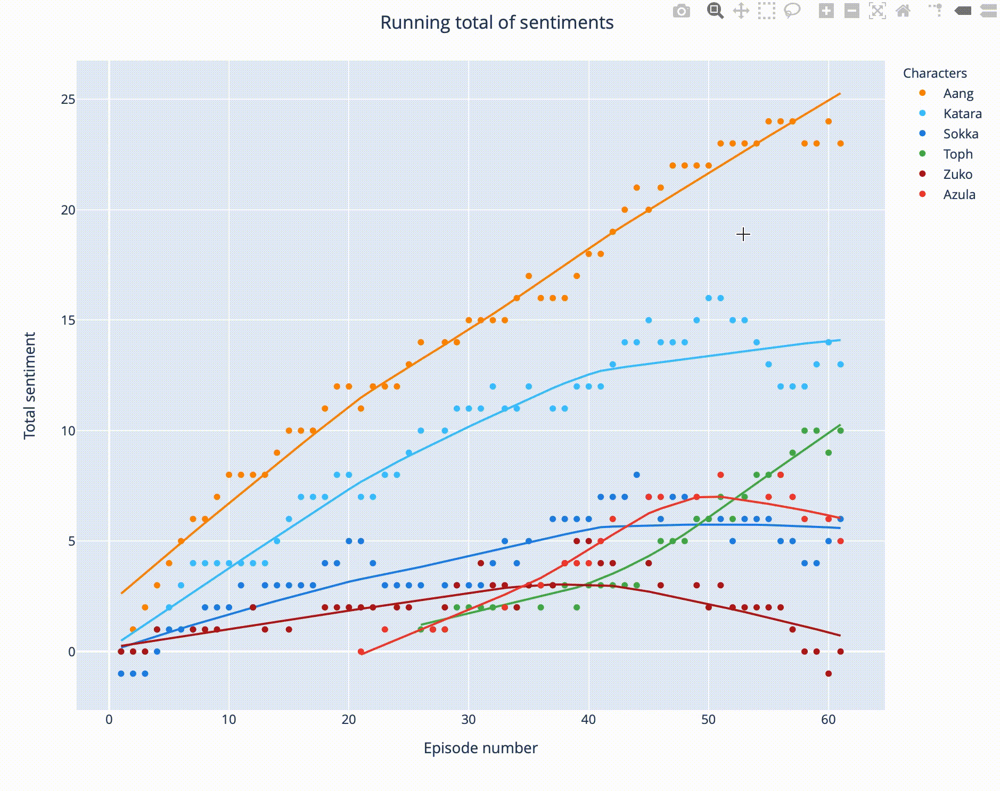

# Using Sentiment Analysis to Visualize Character Arcs in Avatar: The Last Airbender
End-to-end data science project in Python: 1) data scraping, 2) sentiment analysis, 3) and data visualization.

# Motivation and project description

I was curious to see if sentiment scores could be used to visualize character arcs. If so, could sentiment analysis help writers evaluate character development in their work?

For this project, I analyzed one of my favorite TV shows *Avatar: The Last Airbender.* I used Jupyter Notebook to document my project. Follow along to see how to:
1) Scrape the web for episode transcripts with *Beautiful Soup*
2) Manipulate data with *pandas* and analyze character dialogue using *VADER*
3) Create interactive visualizations of the sentiment scores with *Plotly Express*

See the accompanying [Medium blog post](https://medium.com/data-comet/atla-sentiment-analysis-43f26edddad2) for detailed project tutorial and discussion.

# Visualizations

# Running the code
You must have [Jupyter Notebook](https://jupyter.readthedocs.io/en/latest/install.html) installed on your computer. Download [atla_sentiment_analysis.ipynb](atla_sentiment_analysis.ipynb) to current directory and open Jupyter Notebook by running `jupyter notebook` in the command line.
